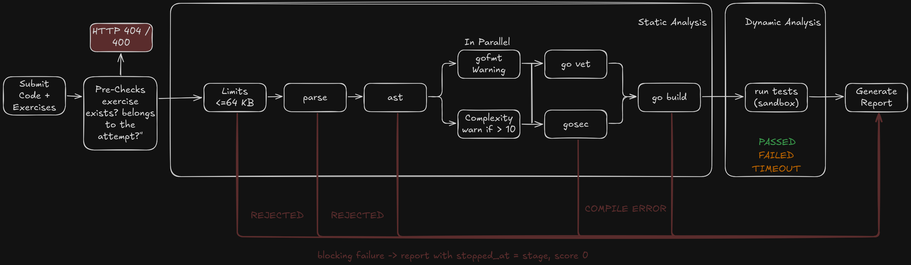

# Evaluation pipeline

[← Back to the README](../README.md)

What happens to a submission: the static analysis (stages 1–8), the dynamic analysis (stage 9) and how results are compared.



## Stages

Stages run in this order. A blocking stage that fails ends the evaluation, and
the report shows where it stopped in `summary.stopped_at`. Stages 1–8 are the
**static analysis** (reported in `static.checks`); stage 9 is the **dynamic
analysis** (reported in `dynamic.tests`).

| # | Stage (`name`) | Blocking | Verdict on failure |
|---|----------------|----------|--------------------|
| 1 | `limits` — code up to 64 KB | yes | `rejected` |
| 2 | `parse` — `go/parser` | yes | `rejected` |
| 3 | `ast` — `package solution`, allowlisted imports, signature, no `main`/`init`/`import "C"`/`//go:` directives | yes | `rejected` |
| 4 | `gofmt` | no (warning) | — |
| 5 | `complexity` — cyclomatic > 10 | no (warning) | — |
| 6 | `vet` — `go vet` | yes | `rejected` (or `compile_error` if the code does not type-check) |
| 7 | `gosec` | only HIGH severity | `rejected` |
| 8 | `build` — `go build`, `CGO_ENABLED=0` | yes | `compile_error` |
| 9 | execution | — | `passed`, `failed` or `timeout` |

Stages 4 and 5 run in parallel, as do 6 and 7. An unknown exercise, one
outside the attempt, or a submission to an exam that has ended is refused
before the pipeline (HTTP 404/400).

## Dynamic analysis

Stage 9 runs only if the code passed the static analysis and compiled. The
program (the student's function plus a generated [harness](#the-harness-how-the-code-is-run))
is run once, receiving all the tests as JSON on stdin, inside a
temporary directory with a clean environment (and inside Firejail when
available). For each test it records:

| Observed | How | Shown as |
|----------|-----|----------|
| Return value | serialised to JSON and compared with the expected output | `got` / `expected`, `passed` |
| Execution time | measured around the call | `duration_ms` |
| Timeout | each call runs in a goroutine with a timer (`timeout_ms`); the whole run also has a global timeout that kills the process group | error `timeout`, verdict `timeout`; later tests are reported as not run |
| Panic | `recover()` around each call, so the other tests still run | error `panic: …` |
| Crash | the process exits without reporting some results | error `o programa terminou inesperadamente…` |
| Output flood | stdout/stderr capped at 1 MB | error `a saída excedeu 1 MB` |
| Unserialisable result | e.g. `NaN` | error `resultado não serializável…` |

Anything the student prints goes to stderr and is ignored; it cannot break or
forge the results (see [Security](security.md)). The score is the
fraction of tests passed, so partial solutions get partial credit.

Allowed imports: `fmt`, `math`, `strings`, `strconv`, `sort`, `slices`,
`maps`, `unicode`, `unicode/utf8`, `errors`.

## The harness: how the code is run

The student writes only a function, such as `Factorial(n int) int` in
`package solution`. A function cannot run by itself, so for every submission
Gavel **generates a small `main` program, the harness**, that calls it once
per test and reports what happened. The template is in
[`internal/engine/harness.go`](../internal/engine/harness.go); it is filled
in with the exercise's function name, parameter types, return type and
timeout, so each exercise gets its own harness.

### The temporary module

Each submission is built in a fresh temporary directory:

```
go.mod                 → module sandbox
solution/solution.go   → the student's code (package solution)
main.go                → the generated harness (package main)
```

The harness imports `sandbox/solution`. The student's code is a separate
package: it cannot see or change the grader's code, and it is compiled
exactly as written.

### What the generated harness does

Simplified, for `Factorial`:

```go
func main() {
	var tests [][]json.RawMessage
	json.NewDecoder(os.Stdin).Decode(&tests)      // 1. every test's input, from stdin

	nonce := os.Getenv("GAVEL_NONCE")             // 2. a secret the student cannot read
	out := os.Stdout
	os.Stdout = os.Stderr                         // 3. the student's prints go to stderr

	for i, input := range tests {
		res := run(i, input)
		res.Nonce = nonce
		data, _ := json.Marshal(res)
		fmt.Fprintf(out, "\n@@RESULT@@ %s\n", data) // 4. one tagged line per test
		if res.Error == "timeout" {
			os.Exit(0)                            //    a stuck goroutine dies with the process
		}
	}
}

func run(index int, input []json.RawMessage) result {
	var a0 int
	json.Unmarshal(input[0], &a0)                 // arguments decoded to their real types

	done := make(chan outcome, 1)
	go func() {                                   // 5. the call runs in its own goroutine
		defer func() {
			if r := recover(); r != nil {
				done <- outcome{err: fmt.Sprintf("panic: %v", r)}
			}
		}()
		got := solution.Factorial(a0)
		data, _ := json.Marshal(got)
		done <- outcome{got: data}
	}()
	select {                                      // 6. whichever comes first
	case o := <-done:                             //    a value or a panic
		// record got / error and duration
	case <-time.After(timeout):                   //    or the time limit
		res.Error = "timeout"
	}
	return res
}
```

| Design | Why |
|--------|-----|
| All tests in one run, input as JSON on stdin | one build and one process per submission; large integers keep full precision |
| Arguments decoded into the declared types (`int`, `[]int`, `map[string]int`, …) | the function receives real Go values; the types come from the validated exercise, so they are safe to put into generated code |
| Each call in a goroutine with `recover()` | a panic fails only that test, and the other tests still run |
| `select` with a timer (`timeout_ms`) | an infinite loop becomes a `timeout` instead of hanging the grader; the harness exits and later tests are reported as not run |
| `os.Stdout` redirected to stderr before the first call | `fmt.Println` in the student's code cannot mix with the results |
| Result lines tagged `@@RESULT@@` and carrying a random nonce | package initialisers run before `main` and could print fake results; they cannot know the nonce (reading it needs `os`, which is not allowed), so their lines are ignored |

### What the runner does around it

[`internal/engine/runner.go`](../internal/engine/runner.go):

1. builds the module with `go build` (`CGO_ENABLED=0`, offline);
2. runs the binary with a clean environment (a minimal `PATH` and
   `GAVEL_NONCE`), inside Firejail when available, with a **global timeout**
   (sum of the per-test timeouts plus a margin) that kills the whole process
   group;
3. caps stdout and stderr at 1 MB;
4. keeps only the lines with the right prefix **and** nonce;
5. compares each `got` with the expected output as JSON (`reflect.DeepEqual`;
   a `nil` slice or map equals `[]` or `{}`);
6. explains missing results (earlier timeout, crash, output too large) and
   builds `dynamic.tests` in the report;
7. deletes the temporary directory.
